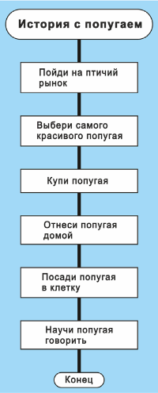
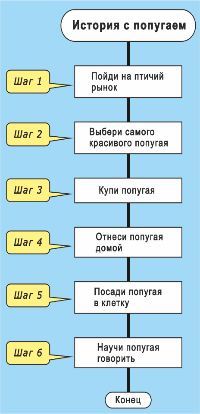
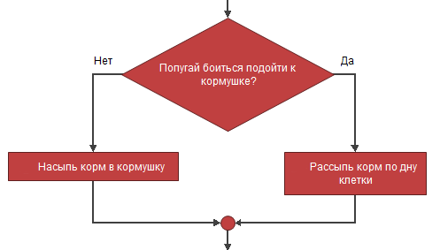

##Что такое программирование?


Итак, прежде всего, уясним для себя, что же понимают под термином программирования? Сейчас многие называют себя программистами, не зная даже о том, что это такое: на проверку оказывается, что человек, изменивший пару строк кода в HTML-документе уже готов считать себя программистом. Но на самом деле, работая с HTML (именно с самим HTML), стать программистом нельзя, поскольку HTML, что явствует из названия (Hypertext Markup Language - язык разметки гипертекста), языком программирования не является.

В результате мы имеем первое условие: для изучения программирования нужен какой-либо язык программирования. В нашем случае это будет учебный визуальный язык программирования блок-схем Flowgoritm.

Далее, допустим кто-то, называющий себя программистом, не только правил пару строк кода HTML, но и видел супер-модную среду разработки, и даже нарисовал в неё форму с 2-3 кнопками и текстовым полем. Это ли программист? Скорее всего, тоже нет. Дело в том, что под визуальной оболочкой, на самом деле, скрывается сложнейший механизм, обеспечивающий взаимодействия элементов управления (тех же кнопок) с пользователем и операционной системой - с одной стороны, и позволяющий выполнять практически любые вычислительные действия - с другой. При всем этом следует уметь делать главное - составлять алгоритмы поведения программы - будь то ее реакция на нажатие той или иной кнопки, или создание функции для решения сложного математического уравнения.

Так вот, программирование в, своем современном понятии, включает в себя знание принципов работы операционной системы, взаимодействия ее компонентов и внутреннего устройства. Ну и при этом сохраняется классическое определение программирования, а именно - умение составлять алгоритмы, математические и поведения программы. В данном курсе будут рассматриваться алгоритмические основы программирования, чтобы дальнейшее изучение синтаксиса было лёгким и приятным!


##Блок-схема алгоритма
Для начала небольшой словарик:

> Алгоритм — точно описанная последовательность действий.    
> Визуальный алгоритм — алгоритм, изображенный не в виде текста, а в виде наглядной картинки.    
> Программа — последовательность действий, которые человек ленится выполнять сам и поэтому поручает компьютеру или роботу.   

Блок-схема представляет собой "чертеж" алгоритма.
 
На рисунке выше показан простейший алгоритм. Читать его нужно сверху вниз. Он содержит шесть действий:

* Пойди на птичий рынок.
* Выбери самого красивого попугая.
* Купи попугая.
* Отнеси попугая домой.
* Посади попугая в клетку.
* Научи попугая говорить.

Действия выполняются последовательно, по очереди. Сначала одно, потом другое, затем третье.    
Время направлено вертикально вниз. Алгоритм нарисован по принципу «Чем ниже, тем позже». Например, действие «Отнеси попугая домой» выполняется позже, чем действие «Купи попугая». Прямоугольная иконка - это «инструкция», которую можно исполнять. 

Алгоритм делится на мелкие порции — шаги, которые следуют друг за другом (шаг за шагом).

Мы видим, что не все фигуры являются шагами. Фигур восемь, а шагов только шесть.
На каждом шаге выполняется одно действие, одна инструкция. Шаги выполняются поочередно и решают поставленную задачу. Главная и Конец (закругленные фигуры) — это обрамление алгоритма; они не выполняют никаких действий.
Можно сказать по-другому: алгоритм есть графическая инструкция (памятка) для человека, который будет его выполнять.

Бегунок — это воображаемая точка, которая перемещается (бегает) по алгоритму. Зачем? Чтобы помочь студентам понять суть алгоритма.
Разумеется, она бегает не беспорядочно, а подчиняясь строгой дисциплине. Бегунок всегда держит путь из Начала в Конец, двигаясь по алгоритму от одной фигуры к следующей. Точно так же, как поезд следует от одной станции к другой.
На рисунке выше бегунок начинает свой путь в самом верху. Приступая к работе, он (бегунок) начинает алгоритм с пункта «Главная». Затем делает шаг вниз и читает приказ: «Пойди на птичий рынок». Затем спускается еще на шаг и читает следующий приказ «Выбери самого красивого попугая». Далее он, действуя тем же порядком, перемещается вертикально вниз по всем фигурам. И заканчивает свой путь в иконке Конец. Конец — делу венец.
Если вам не нравится слово «бегунок», вместо него можно сказать: рабочая точка алгоритма.

```
## Иконка "Вопрос"

В верхней части рисунка изображена иконка "Вопрос". Почему она так называется? Потому, что в ней пишут «да-нетный вопрос». То есть вопрос, на который можно ответить либо «Да», либо «Нет». Все другие ответы запрещены.
В нашей жизни да-нетные вопросы встречаются очень часто. Вот примеры: утюг сломался? Вася купил хлеб? Поезд пришел? Преступника арестовали? Делегация приехала? «Спартак» выиграл? Эта доска короче, чем та? На улице температура выше нуля?
На рисунке в иконке Вопрос находится вопросительное предложение: «Попугай боится подойти к кормушке?» При ответе «Да» выполняется действие «Рассыпь корм по дну клетки». При ответе «Нет» — «Насыпь корм в кормушку».
Чтобы понять смысл иконки Вопрос, нужно читать ее сверху вниз. Именно так поступает бегунок. Он входит в икону Вопрос сверху, а выходит вниз или вправо.
Алгоритмы нужны, чтобы решать сложные жизненные задачи. Такие задачи обычно содержат много развилок. Поэтому в алгоритмах нередко приходится использовать иконку Вопрос. Ее применяют всякий раз, когда нужно выбрать одно направление из двух.
Иногда в алгоритме надо сделать не одну, а целый ряд развилок. Для этого используют несколько иконок Вопрос.
```