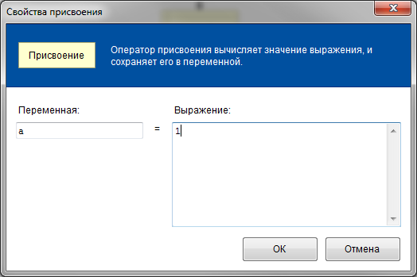
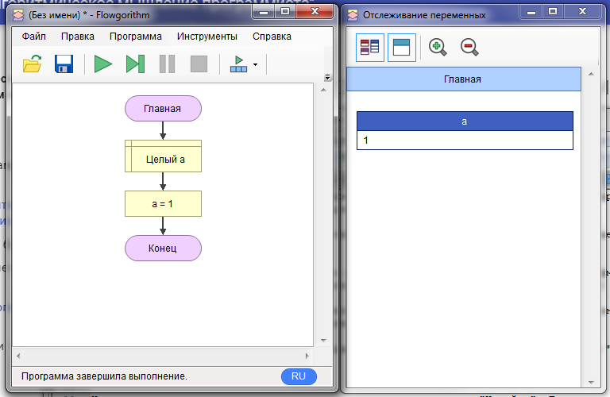

Переменную можно сравнить с контейнером, в котором можно хранить обычные числа, последовательности чисел (массивы) или строки.    
Посмотрим, как работают переменные.  Попробуем объявить переменную.      
Для этого сначала запустим *Flowgoritm* и нажмем правой кнопкой на стрелочку между "Главная" и "Конец". Затем выберем фигуру объявление:    

У вас должен появиться серый прямоугольник "Объявление". Жмем по нему два раза и открывается диалоговое окно. В нём надо ввести имя переменной и выбрать её тип. Имя переменной (идентификатор) должно удовлетворять условиям:

* Первым символом идентификатора должна быть латинская буква.
* Вторым и последующим символом идентификатора может быть латинская буква или цифра.
* Идентификатор не должен повторять зарезервированные слова в языке.

Тип переменной определяет какое множество значений она может содержать и доступные операции над этими значениями. К счастью, типов не так много, они еще называются типами данных:

* Целый тип данных - включает множество целых чисел (2,8,-1) и целочисленные арифметические операции (+,-,*,/,%).   
* Вещественный тип данных - включает множество рациональных чисел(0.5, -985.6544) и арифметические операции над вещественными числами (+,-,*,/).    
* Строковый тип данных - включает множество символов алфавита и операцию объединения строк.    
* Логический тип данных - включает значения истина/ложь и логические операции.    

Все типы данных также поддерживают операцию сравнения. Итак, создадим переменную "а" целого типа. Вводим имя и нажимаем "ОК":

На схеме в прямоугольнике с рамками должна появиться надпись "Целый a". Теперь попробуем изменить значение в этой переменной, для этого нажимаем правой кнопкой на линию между "Целый a" и "Конец" и выбираем "Присвоение". Повиться серый блок на схеме. Теперь двойной щелчок и должно открыться диалоговое окно. В нем с левой стороны вводим "a",справа, допустим 1:

Нажимаем "ОК". Теперь общий вид программы должен быть как на картинке ниже:

Операция присвоения может использоваться в любой момент. Кстати, когда мы ввели число "1", то тем самым мы записали константу. Так называются неизменяемые величины. К примеру, вот константы разных типов: 8, 3.14, true, "hello".

Теперь попробуем запустить наше первое творение. Откройте вкладку Инструменты->Окно отслеживания переменных...    
Затем нажмите на зеленый треугольник "Запустить" и посмотрите на результат в окошке:

В окне отслеживания должен появиться прямоугольник "a" со значением "1", а внизу слева надпись "Программа завершила выполнение".