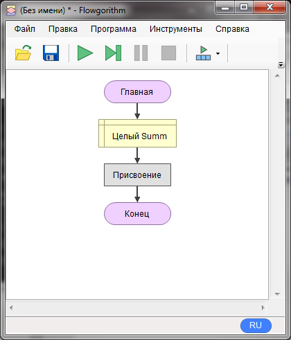
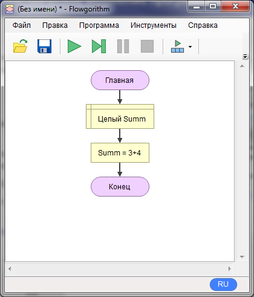
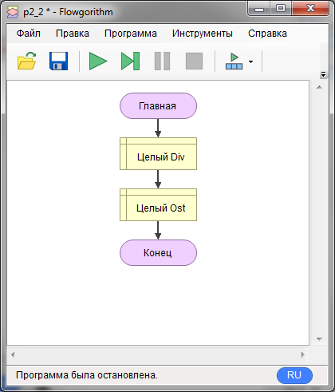
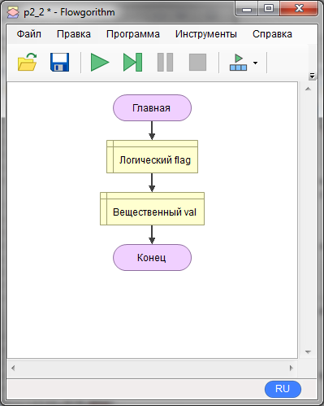
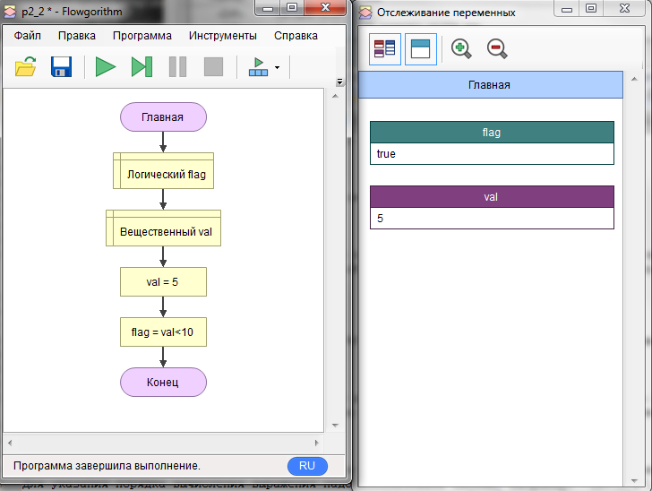

Итак, давайте познакомимся с выражениями. Нет, не крылатыми, разумеется, а выражение, которое будет правильное для языка блок-схем.    
Для начала создадим целочисленную переменную "Summ" и добавим пустой блок присваивания. У вас должно получиться:

Теперь мы сделаем присваивание не константе, а арифметическому выражению. Пусть это будет сумма: "3+4". Открываем блок "присвоение", в левую часть пишем "Summ", в правую 3+4. После "ок" у вас должно получиться:

Отлично, осталось запустить и понаблюдать за окном отслеживания:

Как видите, выражение вычислилось и результат попал в переменную Summ. Для целых чисел кроме операций +,-,*,/ вы еще можете использовать остаток от деления. Давайте проведем эксперимент попробуем разделить целое число 7 на 3 и еще получить остаток от деления. Для этого заведем две переменные Div и Ost:

Теперь присвоим Div выражение "7/3", а Ost "7%3". Запустим и посмотрим на окошко отслеживания:

Видите, что целочисленное деление отбрасывает дробную часть? Это надо запомнить. Теперь удалим переменную Ost и её блок присваивания. Для этого надо выделить блок и нажать DEL. Затем изменим тип переменной Div на вещественный. Должно получиться так:

После запуска в отслеживании должно получиться число "2.3333333". Теперь деление работает как в калькуляторе.  
Для указания порядка вычисления выражения надо использовать скобки, например: "(8+7)/4".
Вместо констант в выражении можно указывать имена переменных. Давайте попробуем поработать с логическим типом. Добавьте две переменных: flag - логического типа и val - вещественного.

Далее, присвоим val значение 5, а в блоке присвоения для flag укажем выражение "val<10". То есть будем сравнивать значение переменной val с константой 10 и получать логическое значение. В данном случае ИСТИНА(true) будет если val меньше 10, а ЛОЖЬ(false), если val меньше либо равно 10. Состояние переменных после запуска:

Попробуйте поменять значение val, а также операцию сравнения, следите за изменением значения flag. Допустимы варианты: >,<,>=,<=,==(равенство),!=(неравенство).