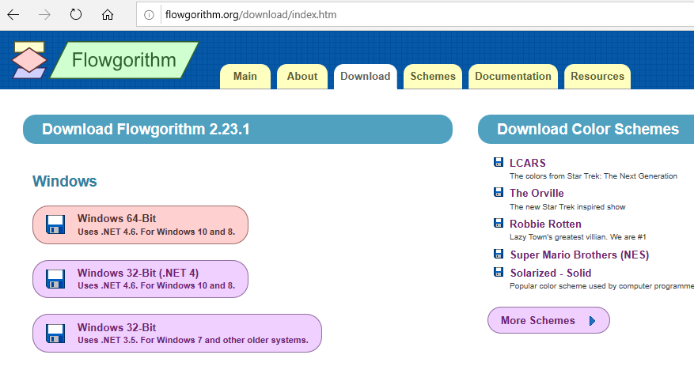
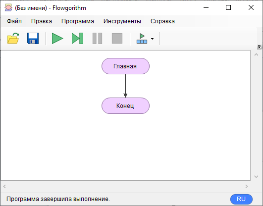

Flowgorithm является бесплатным приложением, для создания программы с помощью простых блок-схем. Прейдите на сайт для загрузки: [http://flowgorithm.org/download/index.htm](http://flowgorithm.org/download/index.htm)
И выберите установщик для вашей операционной системы:



После скачивания распакуйте архив и запустите ```Flowgorithm Setup.msi```
После установки появится раздел в меню пуск. Запустите программу, у вас должно быть так:


Переключите язык на русский, нажав синюю кнопку *EN* внизу справа. Запустите программу, нажав на зеленый треугольник, у вас должна быть подпись внизу ```Программа завершила выполнение.```:

