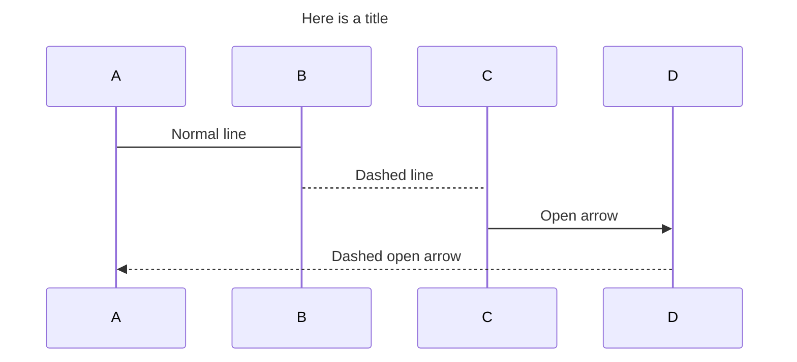

Шпаргалка по Markdown
---------------------

Поиграть с разметкой Markdown можно на [демо-странице](http://www.markdown-here.com/livedemo.html).

##### Содержание  
[Заголовки](#headers)  
[Выделение](#emphasis)  
[Списки](#lists)  
[Ссылки](#links)  
[Изображения](#images)  
[Подсветка кода и синтаксиса](#code)  
[Таблицы](#tables)  
[Цитаты](#blockquotes)  
[Встроенный HTML](#html)  
[Горизонтальная линия](#hr)  
[Новая строка](#lines)  
[Admonition](#admonition)  
[Details](#details)  
[Github Emoji](#emoji)  
[UML Sequence Diagrams](#uml)  
[Math formulas](#math)  

<a name="headers"><h2>Заголовки</h2></a>

```no-highlight
# H1
## H2
### H3
#### H4
##### H5
###### H6

Кроме того, H1 и H2 можно обозначить подчеркиванием:

Alt-H1
======

Alt-H2
------
```

# H1
## H2
### H3
#### H4
##### H5
###### H6

Кроме того, заголовки H1 и H2 можно обозначить подчеркиванием:

Alt-H1
======

Alt-H2
------

<a name="emphasis"><h2>Выделение</h2></a>

```no-highlight
Курсив обозначается *звездочками* или _подчеркиванием_.

Полужирный шрифт - двойными **звездочками** или __подчеркиванием__.

Комбинированное выделение **звездочками и _подчеркиванием_**.

Для зачеркнутого текста используются две тильды . ~~Уберите это.~~
```

Курсив обозначается *звездочками* или _подчеркиванием_.

Полужирный шрифт - двойными **звездочками** или __подчеркиванием__.

Комбинированное выделение **звездочками и _подчеркиванием_**.

Для зачеркнутого текста используются две тильды . ~~Уберите это.~~


<a name="lists"><h2>Списки</h2></a>

(В данном примере предшествующие и завершающие пробелы обозначены точками: ⋅)

```no-highlight
1. Первый пункт нумерованного списка
2. Второй пункт
⋅⋅*Ненумерованный вложенный список.
1. Сами числа не имеют значения, лишь бы это были цифры
⋅⋅1. Нумерованный вложенный список
4. И еще один пункт.

⋅⋅⋅Внутри пунктов списка можно вставить абзацы с таким же отступом. Обратите внимание на пустую строку выше и на пробелы в начале (нужен по меньшей мере один, но здесь мы добавили три, чтобы также выровнять необработанный Markdown).

⋅⋅⋅Чтобы вставить разрыв строки, но не начинать новый параграф, нужно добавить два пробела перед новой строкой.⋅⋅
⋅⋅⋅Этот текст начинается с новой строки, но находится в том же абзаце.⋅⋅
⋅⋅⋅(В некоторых обработчиках, например на Github, пробелы в начале новой строки не нужны.)

* Ненумерованный список можно размечать звездочками
- Или минусами
+ Или плюсами
```

1. Первый пункт нумерованного списка
2. Второй пункт
  * Ненумерованный вложенный список.
1. Сами числа не имеют значения, лишь бы это были цифры
  1. Нумерованный вложенный список
4. И еще один пункт.

   Внутри пунктов списка можно вставить абзацы с таким же отступом. Обратите внимание на пустую строку выше и на пробелы в начале (нужен по меньшей мере один, но здесь мы добавили три, чтобы также выровнять необработанный Markdown).

   Чтобы вставить разрыв строки, но не начинать новый параграф, нужно добавить два пробела перед новой строкой.
   Эта текст начинается с новой строки, но находится в том же абзаце.
   (В некоторых обработчиках, например на Github, пробелы в начале новой строки не нужны.)

* Ненумерованный список можно размечать звездочками
- Или минусами
+ Или плюсами

<a name="links"><h2>Ссылки</h2></a>

Ссылки можно оформить разными способами.

```no-highlight
[Обычная ссылка в строке](https://www.google.com)

[Обычная ссылка с title](https://www.google.com "Сайт Google")

[Ссылка со сноской][Произвольный регистронезависимый текст]

[Относительная ссылка на документ](../blob/master/LICENSE)

[Для ссылок со сноской можно использовать цифры][1]

Или можно просто вставить ссылку в квадратные скобки [текст ссылки]

Произвольный текст, после которого можно привести ссылки.

[произвольный регистронезависимый текст]: https://www.mozilla.org
[1]: http://slashdot.org
[текст ссылки]: http://www.reddit.com
```

[Обычная ссылка в строке](https://www.google.com)

[Обычная ссылка с title](https://www.google.com "Сайт Google")

[Ссылка со сноской][Произвольный регистронезависимый текст] *

[Относительная ссылка на документ](../blob/master/LICENSE)

[Для ссылок со сноской можно использовать цифры][1]

Или можно просто вставить ссылку в квадратные скобки [текст ссылки]

Произвольный текст, после которого можно привести ссылки.

[Произвольный регистронезависимый текст]: https://www.mozilla.org
[1]: http://slashdot.org
[текст ссылки]: http://www.reddit.com

(*) Для символов не входящих в ASCII, например кириллицы, текст сноски все-таки регистрозависим (прим. перев.)

<a name="images"><h2>Изображения</h2></a>

```no-highlight
Вот наш логотип (наведите указатель, чтобы увидеть текст заголовка):

Внутри строки:  


В сноске:  
![alt-текст][logo]

[logo]: https://github.com/adam-p/markdown-here/raw/master/src/common/images/icon48.png "Текст заголовка логотипа 2"
```

Вот наш логотип (наведите указатель, чтобы увидеть текст заголовка):

Внутри строки:  


В сноске:  
![alt-текст][logo]

[logo]: https://github.com/adam-p/markdown-here/raw/master/src/common/images/icon48.png "Текст заголовка логотипа 2"

<a name="code"><h2>Код и подсветка синтаксиса</h2></a>

Блоки кода являются частью функций Markdown, но не подсветка синтаксиса. Однако многие обработчики, например Github или *Markdown Here*, поддерживают подсветку синтаксиса. Список поддерживаемых языков и способ их указания может различаться. *Markdown Here* поддерживает десятки языков (и не-языков, например синтаксис diff и заголовки HTTP); полный список и способ указания языков см. на странице [highlight.js demo-странице](http://softwaremaniacs.org/media/soft/highlight/test.html).

```no-highlight
`Код` в строке обрамляется `обратными апострофами`.
```

`Код` в строке обрамляется `обратными апострофами`.

Блоки кода выделяются либо тремя обратными апострофами <code>```</code> либо четырьмя пробелами в каждой строке. Рекомендуется использовать три апострофа -- они проще и только они поддерживают подсветку синтаксиса.

<pre lang="no-highlight"><code>```javascript
var s = "Подсветка JavaScript";
alert(s);
```
 
```python
s = "Подсветка Python"
print s
```
 
```
Язык не указан, синтаксис не подсвечен.
Но мы вставим в него &lt;b&gt;тег&lt;/b&gt;.
```
</code></pre>


```javascript
var s = "Подсветка JavaScript";
alert(s);
```
 
```python
s = "Подсветка Python"
print s
```

```
Язык не указан, синтаксис не подсвечен (некоторые обработчики все же подсвечивают).
Но мы вставим в него <b>тег</b>.
```


<a name="tables"><h2>Таблицы</h2></a>

Таблицы не являются частью Markdown, но многие обработчики, например *Markdown Here* и Github, поддерживают их. Они позволяют легко добавить таблицы в электронное письмо -- в других случаях для этого нужно копировать их из другого приложения.

```no-highlight
Вертикальные линии обозначают столбцы.

| Таблицы       | Это                | Круто |
| ------------- |:------------------:| -----:|
| столбец 3     | выровнен вправо    | $1600 |
| столбец 2     | выровнен по центру |   $12 |
| зебра-строки  | прикольные         |    $1 |

Внешние вертикальные линии (|) не обязательны и нужны только, чтобы сам код Markdown выглядел красиво. Тот же код можно записать так:

Markdown | не такой | красивый
--- | --- | ---
*Но выводится* | `так же` | **клево**
1 | 2 | 3
```

Вертикальные линии обозначают столбцы.

| Таблицы       | Это                | Круто |
| ------------- |:------------------:| -----:|
| столбец 3     | выровнен вправо    | $1600 |
| столбец 2     | выровнен по центру |   $12 |
| зебра-строки  | прикольные         |    $1 |

Внешние вертикальные линии (|) не обязательны и нужны только, чтобы сам код Markdown выглядел красиво. Тот же код можно записать так:

Markdown | не такой | красивый
--- | --- | ---
*Но выводится* | `так же` | **клево**
1 | 2 | 3

<a name="blockquotes"><h2>Цитаты</h2></a>

```no-highlight
> С помощью цитат очень удобно в письме обозначать исходный текст.
> Эта строка - часть той же цитаты.

Разрыв цитаты.

> Это очень длинная строка, но она будет правильно процитирована даже при размещении на нескольких строках. Продолжаем писать, чтобы эта строка не вмещалась на одной строке в любом окне. Кстати, в цитаты можно *вставлять* даже **Markdown**.
```

> С помощью цитат очень удобно в письме обозначать исходный текст.
> Эта строка - часть той же цитаты.

Разрыв цитаты.

> Это очень длинная строка, но она будет правильно процитирована даже при размещении на нескольких строках. Продолжаем писать, чтобы эта строка не вмещалась на одной строке в любом окне. Кстати, в цитаты можно также *размечать* с помощью **Markdown**.

<a name="html"><h2>Встроенный HTML</h2></a>

Часто Markdown понимает чистый HTML.

```no-highlight
<dl>
  <dt>Список определений</dt>
  <dd>Это то, что люди иногда используют.</dd>

  <dt>Markdown внутри HTML</dt>
  <dd>Работает *не очень** хорошо. Используйте HTML-<em>теги</em>.</dd>
</dl>
```

<dl>
  <dt>Список определений</dt>
  <dd>Это то, что люди иногда используют.</dd>

  <dt>Markdown внутри HTML</dt>
  <dd>Работает *не очень** хорошо. Используйте HTML-<em>теги</em>.</dd>
</dl>

<a name="hr"><h2>Горизонтальные линии</h2></a>

```
Три и более...

---

Дефисы

***

Звездочки

___

Подчеркивания
```

Три и более...

---

Дефисы

***

Звездочки

___

Подчеркивания

<a name="lines"><h2>Новая строка</h2></a>

Для понимания работы разрыва строка автор главным образом рекомендует экспериментировать и пробовать -- нажмите &lt;Enter&gt; один раз (т.е. перейдите на новую строку), потом нажмите дважды (т.е. вставьте две новые строки) и посмотрите что приозошло. Вы сразу поймете что вам нужно. В расширении [Markdown Here](https://github.com/adam-p/markdown-here) для браузеров есть удобная функция "Markdown Toggle", которая поможет в этом.

*Примечание переводчика:*  
*Для переноса на новую строку в конце предыдущей строки необходимо добавить* **два пробела**. *Без этого большинство парсеров Markdown не выполняют переход на новую строку.*

Попробуйте ввести следующее:

```
Это начальная строка

Эта строка отделена от предыдущей двумя новыми строками и станет *отдельным абзацем*.

Это тоже отдельный абзац, но...⋅⋅
Эта строка отделена одной новой строкой, поэтому она находится в *том же абзаце*.
```

Это начальная строка

Эта строка отделена от предыдущей двумя новыми строками и станет *отдельным абзацем*.

Это тоже отдельный абзац, но...`[здесь два пробела]`  
Эта строка отделена одной новой строкой, поэтому она находится в *том же абзаце*.  

<a name="admonition"><h2>Admonition</h2></a>

```
!!! Attention "Success!"
    You can use inline ~~stuff~~ markup too!

!!! Hint "Info!"
    - Here is some info.
    - And some more

!!! Caution "Warning!"
    - [X] Make sure you turn off the stove
    - [X] Don't run with scissors

!!! Danger "Alert!"
    You really need to read [this](#admonition)!

!!! Question "Question?"
    Are you serious?

!!! Note "Note"
    :smile:

    > Not all markup can be placed in these boxes, but you can fit all sorts of things in them. But you will notice that the styles don't always play nice with each other.  Additional CSS could fix this though.

    Stuff like _this_ works too.

    | _Colors_      | Fruits          | Vegetable    |
    | ------------- |:---------------:| ------------:|
    | Red           | *Apple*         | Pepper       |
    | ~~Orange~~    | `Oranges`       | **Carrot**   |
    | Green         | ~~***Pears***~~ | Spinach      |

        :::javascript
        // Fenced **with** highlighting
        function doIt() {
            for (var i = 1; i <= slen ; i^^) {
                setTimeout("document.z.textdisplay.value = newMake()", i*300);
                setTimeout("window.status = newMake()", i*300);
            }
        }

!!! Unknown "Title"
    `Default` class style
```

!!! Attention "Success!"
    You can use inline ~~stuff~~ markup too!

!!! Hint "Info!"
    - Here is some info.
    - And some more

!!! Caution "Warning!"
    - [X] Make sure you turn off the stove
    - [X] Don't run with scissors

!!! Danger "Alert!"
    You really need to read [this](#admonition)!

!!! Question "Question?"
    Are you serious?

!!! Note "Note"
    :smile:

    > Not all markup can be placed in these boxes, but you can fit all sorts of things in them. But you will notice that the styles don't always play nice with each other.  Additional CSS could fix this though.

    Stuff like _this_ works too.

    | _Colors_      | Fruits          | Vegetable    |
    | ------------- |:---------------:| ------------:|
    | Red           | *Apple*         | Pepper       |
    | ~~Orange~~    | `Oranges`       | **Carrot**   |
    | Green         | ~~***Pears***~~ | Spinach      |

        :::javascript
        // Fenced **with** highlighting
        function doIt() {
            for (var i = 1; i <= slen ; i^^) {
                setTimeout("document.z.textdisplay.value = newMake()", i*300);
                setTimeout("window.status = newMake()", i*300);
            }
        }

!!! Unknown "Title"
    `Default` class style

<a name="details"><h2>Details</h2></a>

```
??? "This is a details"
    This is some content
```

??? "This is a details"
    This is some content

<a name="emoji"><h2>Github Emoji</h2></a>
```
This is a test for emoji :smile:.  The emojis are images linked to github assets :octocat:.
```

This is a test for emoji :smile:.  The emojis are images linked to github assets :octocat:.

### People

:+1::-1::alien::angel::anger::angry::anguished::astonished::baby::blue_heart::blush::boom::bow::bowtie::boy::bride_with_veil::broken_heart::bust_in_silhouette::busts_in_silhouette::clap::cold_sweat::collision::confounded::confused::construction_worker::cop::couple::couple_with_heart::couplekiss::cry::crying_cat_face::cupid::dancer::dancers::dash::disappointed::disappointed_relieved::dizzy::dizzy_face::droplet::ear::exclamation::expressionless::eyes::facepunch::family::fearful::feelsgood::feet::finnadie::fire::fist::flushed::frowning::fu::girl::goberserk::godmode::green_heart::grey_exclamation::grey_question::grimacing::grin::grinning::guardsman::haircut::hand::hankey::hear_no_evil::heart::heart_eyes::heart_eyes_cat::heartbeat::heartpulse::hurtrealbad::hushed::imp::information_desk_person::innocent::japanese_goblin::japanese_ogre::joy::joy_cat::kiss::kissing::kissing_cat::kissing_closed_eyes::kissing_heart::kissing_smiling_eyes::laughing::lips::love_letter::man::man_with_gua_pi_mao::man_with_turban::mask::massage::metal::muscle::musical_note::nail_care::neckbeard::neutral_face::no_good::no_mouth::nose::notes::ok_hand::ok_woman::older_man::older_woman::open_hands::open_mouth::pensive::persevere::person_frowning::person_with_blond_hair::person_with_pouting_face::point_down::point_left::point_right::point_up::point_up_2::poop::pouting_cat::pray::princess::punch::purple_heart::question::rage::rage1::rage2::rage3::rage4::raised_hand::raised_hands::raising_hand::relaxed::relieved::revolving_hearts::runner::running::satisfied::scream::scream_cat::see_no_evil::shit::skull::sleeping::sleepy::smile::smile_cat::smiley::smiley_cat::smiling_imp::smirk::smirk_cat::sob::sparkles::sparkling_heart::speak_no_evil::speech_balloon::star::star2::stuck_out_tongue::stuck_out_tongue_closed_eyes::stuck_out_tongue_winking_eye::sunglasses::suspect::sweat::sweat_drops::sweat_smile::thought_balloon::thumbsdown::thumbsup::tired_face::tongue::triumph::trollface::two_hearts::two_men_holding_hands::two_women_holding_hands::unamused::v::walking::wave::weary::wink::woman::worried::yellow_heart::yum::zzz:

### Nature

:ant::baby_chick::bear::bee::beetle::bird::blossom::blowfish::boar::bouquet::bug::cactus::camel::cat::cat2::cherry_blossom::chestnut::chicken::cloud::cow::cow2::crescent_moon::crocodile::cyclone::deciduous_tree::dog::dog2::dolphin::dragon::dragon_face::dromedary_camel::ear_of_rice::earth_africa::earth_americas::earth_asia::elephant::evergreen_tree::fallen_leaf::first_quarter_moon::first_quarter_moon_with_face::fish::foggy::four_leaf_clover::frog::full_moon::full_moon_with_face::globe_with_meridians::goat::hamster::hatched_chick::hatching_chick::herb::hibiscus::honeybee::horse::koala::last_quarter_moon::last_quarter_moon_with_face::leaves::leopard::maple_leaf::milky_way::monkey::monkey_face::moon::mouse::mouse2::mushroom::new_moon::new_moon_with_face::night_with_stars::ocean::octocat::octopus::ox::palm_tree::panda_face::partly_sunny::paw_prints::penguin::pig::pig2::pig_nose::poodle::rabbit::rabbit2::racehorse::ram::rat::rooster::rose::seedling::sheep::shell::snail::snake::snowflake::snowman::squirrel::sun_with_face::sunflower::sunny::tiger::tiger2::tropical_fish::tulip::turtle::umbrella::volcano::waning_crescent_moon::waning_gibbous_moon::water_buffalo::waxing_crescent_moon::waxing_gibbous_moon::whale::whale2::wolf::zap:

### Objects

:8ball::alarm_clock::apple::art::athletic_shoe::baby_bottle::balloon::bamboo::banana::bar_chart::baseball::basketball::bath::bathtub::battery::beer::beers::bell::bento::bicyclist::bikini::birthday::black_joker::black_nib::blue_book::bomb::book::bookmark::bookmark_tabs::books::boot::bowling::bread::briefcase::bulb::cake::calendar::calling::camera::candy::card_index::cd::chart_with_downwards_trend::chart_with_upwards_trend::cherries::chocolate_bar::christmas_tree::clapper::clipboard::closed_book::closed_lock_with_key::closed_umbrella::clubs::cocktail::coffee::computer::confetti_ball::cookie::corn::credit_card::crown::crystal_ball::curry::custard::dango::dart::date::diamonds::dollar::dolls::door::doughnut::dress::dvd::e-mail::egg::eggplant::electric_plug::email::envelope::envelope_with_arrow::euro::eyeglasses::fax::file_folder::fireworks::fish_cake::fishing_pole_and_fish::flags::flashlight::flipper::floppy_disk::flower_playing_cards::football::footprints::fork_and_knife::fried_shrimp::fries::game_die::gem::ghost::gift::gift_heart::golf::grapes::green_apple::green_book::guitar::gun::hamburger::hammer::handbag::headphones::hearts::high_brightness::high_heel::hocho::honey_pot::horse_racing::hourglass::hourglass_flowing_sand::ice_cream::icecream::inbox_tray::incoming_envelope::iphone::jack_o_lantern::jeans::key::kimono::lantern::ledger::lemon::lipstick::lock::lock_with_ink_pen::lollipop::loop::loud_sound::loudspeaker::low_brightness::mag::mag_right::mahjong::mailbox::mailbox_closed::mailbox_with_mail::mailbox_with_no_mail::mans_shoe::meat_on_bone::mega::melon::memo::microphone::microscope::minidisc::money_with_wings::moneybag::mortar_board::mountain_bicyclist::movie_camera::musical_keyboard::musical_score::mute::name_badge::necktie::newspaper::no_bell::notebook::notebook_with_decorative_cover::nut_and_bolt::oden::open_book::open_file_folder::orange_book::outbox_tray::package::page_facing_up::page_with_curl::pager::paperclip::peach::pear::pencil::pencil2::phone::pill::pineapple::pizza::postal_horn::postbox::pouch::poultry_leg::pound::purse::pushpin::radio::ramen::ribbon::rice::rice_ball::rice_cracker::rice_scene::ring::rugby_football::running_shirt_with_sash::sake::sandal::santa::satellite::saxophone::school_satchel::scissors::scroll::seat::shaved_ice::shirt::shoe::shower::ski::smoking::snowboarder::soccer::sound::space_invader::spades::spaghetti::sparkle::sparkler::speaker::stew::straight_ruler::strawberry::surfer::sushi::sweet_potato::swimmer::syringe::tada::tanabata_tree::tangerine::tea::telephone::telephone_receiver::telescope::tennis::toilet::tomato::tophat::triangular_ruler::trophy::tropical_drink::trumpet::tshirt::tv::unlock::vhs::video_camera::video_game::violin::watch::watermelon::wind_chime::wine_glass::womans_clothes::womans_hat::wrench::yen:

### Places

:aerial_tramway::airplane::ambulance::anchor::articulated_lorry::atm::bank::barber::beginner::bike::blue_car::boat::bridge_at_night::bullettrain_front::bullettrain_side::bus::busstop::car::carousel_horse::checkered_flag::church::circus_tent::city_sunrise::city_sunset::cn::construction::convenience_store::crossed_flags::de::department_store::es::european_castle::european_post_office::factory::ferris_wheel::fire_engine::fountain::fr::fuelpump::gb::helicopter::hospital::hotel::hotsprings::house::house_with_garden::it::izakaya_lantern::japan::japanese_castle::jp::kr::light_rail::love_hotel::minibus::monorail::mount_fuji::mountain_cableway::mountain_railway::moyai::office::oncoming_automobile::oncoming_bus::oncoming_police_car::oncoming_taxi::performing_arts::police_car::post_office::railway_car::rainbow::red_car::rocket::roller_coaster::rotating_light::round_pushpin::rowboat::ru::sailboat::school::ship::slot_machine::speedboat::stars::station::statue_of_liberty::steam_locomotive::sunrise::sunrise_over_mountains::suspension_railway::taxi::tent::ticket::tokyo_tower::tractor::traffic_light::train::train2::tram::triangular_flag_on_post::trolleybus::truck::uk::us::vertical_traffic_light::warning::wedding:

### Symbols

:100::1234::a::ab::abc::abcd::accept::aquarius::aries::arrow_backward::arrow_double_down::arrow_double_up::arrow_down::arrow_down_small::arrow_forward::arrow_heading_down::arrow_heading_up::arrow_left::arrow_lower_left::arrow_lower_right::arrow_right::arrow_right_hook::arrow_up::arrow_up_down::arrow_up_small::arrow_upper_left::arrow_upper_right::arrows_clockwise::arrows_counterclockwise::b::baby_symbol::back::baggage_claim::ballot_box_with_check::bangbang::black_circle::black_large_square::black_medium_small_square::black_medium_square::black_small_square::black_square_button::cancer::capital_abcd::capricorn::chart::children_crossing::cinema::cl::clock1::clock10::clock1030::clock11::clock1130::clock12::clock1230::clock130::clock2::clock230::clock3::clock330::clock4::clock430::clock5::clock530::clock6::clock630::clock7::clock730::clock8::clock830::clock9::clock930::congratulations::cool::copyright::curly_loop::currency_exchange::customs::diamond_shape_with_a_dot_inside::do_not_litter::eight::eight_pointed_black_star::eight_spoked_asterisk::end::fast_forward::five::four::free::gemini::hash::heart_decoration::heavy_check_mark::heavy_division_sign::heavy_dollar_sign::heavy_exclamation_mark::heavy_minus_sign::heavy_multiplication_x::heavy_plus_sign::id::ideograph_advantage::information_source::interrobang::keycap_ten::koko::large_blue_circle::large_blue_diamond::large_orange_diamond::left_luggage::left_right_arrow::leftwards_arrow_with_hook::leo::libra::link::m::mens::metro::mobile_phone_off::negative_squared_cross_mark::new::ng::nine::no_bicycles::no_entry::no_entry_sign::no_mobile_phones::no_pedestrians::no_smoking::non-potable_water::o::o2::ok::on::one::ophiuchus::parking::part_alternation_mark::passport_control::pisces::potable_water::put_litter_in_its_place::radio_button::recycle::red_circle::registered::repeat::repeat_one::restroom::rewind::sa::sagittarius::scorpius::secret::seven::shipit::signal_strength::six::six_pointed_star::small_blue_diamond::small_orange_diamond::small_red_triangle::small_red_triangle_down::soon::sos::symbols::taurus::three::tm::top::trident::twisted_rightwards_arrows::two::u5272::u5408::u55b6::u6307::u6708::u6709::u6e80::u7121::u7533::u7981::u7a7a::underage::up::vibration_mode::virgo::vs::wavy_dash::wc::wheelchair::white_check_mark::white_circle::white_flower::white_large_square::white_medium_small_square::white_medium_square::white_small_square::white_square_button::womens::x::zero:

<a name="uml"><h2>UML Sequence Diagrams</h2></a>
````

````


<a name="math"><h2>Math formulas</h2></a>

````tex
Some Equations:

$$
E(\mathbf{v}, \mathbf{h}) = -\sum_{i,j}w_{ij}v_i h_j - \sum_i b_i v_i - \sum_j c_j h_j
$$

- Here are some more equations:

    $$
    p(v_i=1|\mathbf{h})  \\
    p(h_j=1|\mathbf{v}) 
    $$

- Inline equations: $p(x|y) = \frac{p(y|x)p(x)}{p(y)}$.
````

Some Equations:

$$
E(\mathbf{v}, \mathbf{h}) = -\sum_{i,j}w_{ij}v_i h_j - \sum_i b_i v_i - \sum_j c_j h_j
$$

- Here are some more equations:
    
    $$
    p(v_i=1|\mathbf{h})  \\
    p(h_j=1|\mathbf{v}) 
    $$

- Inline equations: $p(x|y) = \frac{p(y|x)p(x)}{p(y)}$.